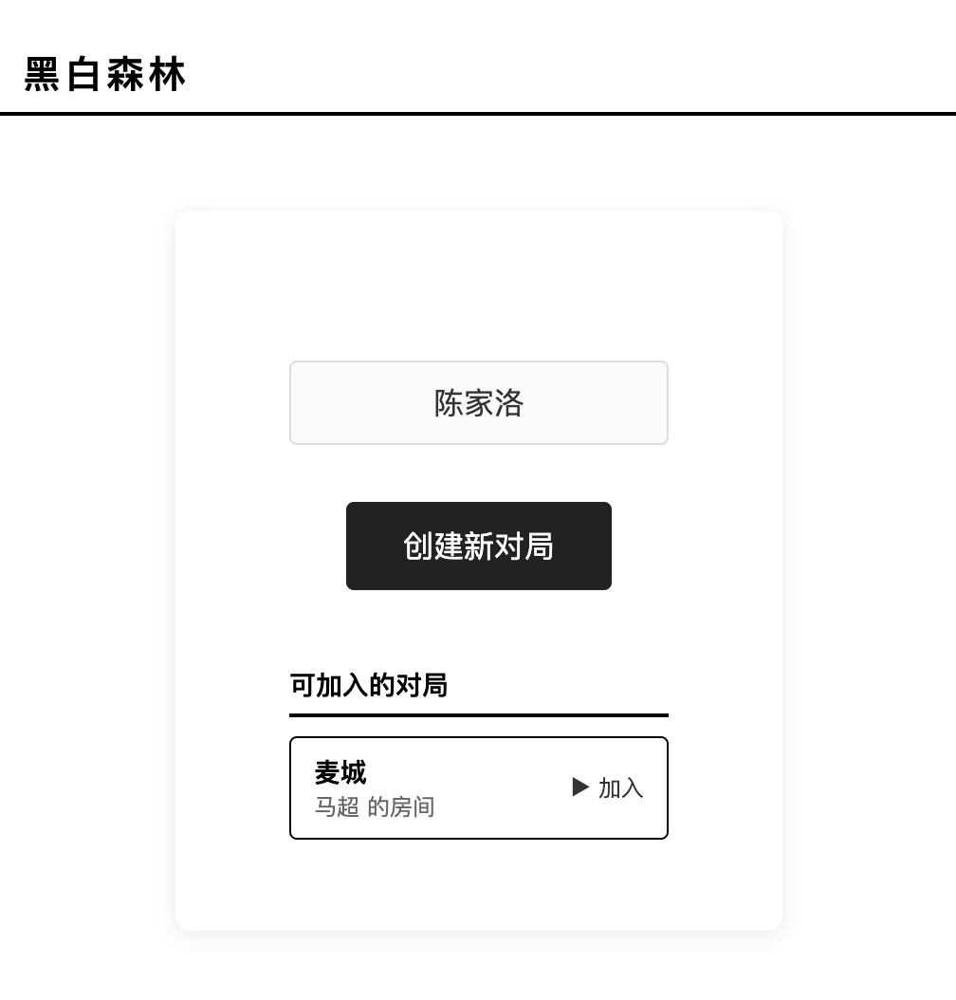
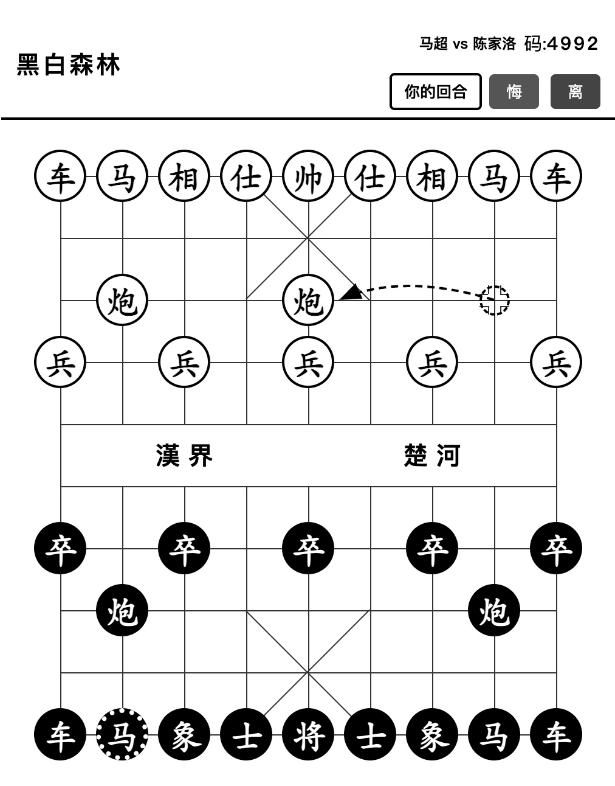

# 黑白象棋 (Xiangqi)

一个简洁现代的中国象棋在线对弈游戏，支持人人对战、人机对战。

**在线试玩**: https://xq.exmm.top

---

## 🌍 Language / 语言

- [English](README.md)
- [中文](README.zh-CN.md) (当前)

点击游戏右上角 🌐 图标可切换语言。

---

## ✨ 功能特性

### 🎮 对战模式
- **人人对战**: 双人同屏，通过房间码邀请好友
- **人机对战**: 5 级 AI 难度可选 (Lv.1 新手 → Lv.5 大师)
- **房间系统**: 生成 6 位房间码，快速分享对战

### 🏰 特色功能
- **🕰️ 历史复盘**: 保存并回放任意对局，可前后翻看每一步
- **💀 人物血条**: 实时战斗状态，展示双方物质力量
- **🎭 性格剪影**: 为每位玩家生成带有个性特点的昵称

### 🤖 AI 智能
- **Minimax + Alpha-Beta 剪枝** 算法
- **5 级难度**: 深度 1-4 层搜索
- 位置评估 + 物质力量综合判断

### 🎨 界面设计
- **双主题**: 明亮模式 / 深色模式
- **护眼特优**: 
  - 纯色背景，无繁杂动画
  - E-ink 墨水屏完美适配 (300ms 延迟无压力)
  - OLED 屏幕友好 (降低视觉疲劳)
- **移动优先**: 手机/平板自适应布局
- **大棋盘**: 优化触控区域，提升落子体验

### 📱 实机效果

<p align="center">
  
</p>

| 列表与对局 | 游戏棋盘 | 结算界面 |
| :---: | :---: | :---: |
|  |  |  |

### 🔧 技术栈
- 前端: 原生 HTML/CSS/JS (无框架，依赖极简)
- 后端: Node.js + Express + WebSocket
- 数据库: SQLite (better-sqlite3)
- 部署: Docker / Docker Compose

---

## 🚀 快速开始

### 本地运行

```bash
# 克隆项目
git clone https://github.com/afeifly/xiangqi.git
cd xiangqi/backend

# 安装依赖
npm install

# 启动服务
npm start
```

访问 http://localhost:3000

### Docker 部署

```bash
cd xiangqi
docker-compose up -d --build
```

常用命令：
```bash
docker-compose logs -f    # 查看日志
docker-compose down       # 停止服务
docker-compose build      # 重新构建
```

---

## 📖 游戏规则

1. 红方先手
2. 点击棋子选中，点击目标位置移动
3. 吃掉对方将/帅即获胜
4. 棋子规则与传统中国象棋一致

---

## 🎯 AI 难度说明

| 等级 | 搜索深度 | 适合玩家 |
|:---:|:---:|:---|
| Lv.1 | 1层 | 第一次玩象棋 |
| Lv.2 | 2层 | 业余爱好者 |
| Lv.3 | 3层 | 中等水平 |
| Lv.4 | 3层+ | 较强对手 |
| Lv.5 | 4层 | 高手挑战 |

---

## 🖥️ 适配说明

### 墨水屏 (E-ink)
- ✅ 无动画残影
- ✅ 高对比度显示
- ✅ 刷新延迟 300ms 内可接受
- 建议：开启深色模式效果更佳

### OLED 屏幕
- ✅ 深色模式减少 OLED 发光
- ✅ 无刺眼动画
- ✅ 省电护眼

### 老年机/低端设备
- ✅ 轻量级前端，加载快速
- ✅ 离线可用 (刷新后)

---

## 📁 项目结构

```
xiangqi/
├── backend/
│   ├── server.js      # 主服务器
│   ├── ai.js          # AI 引擎
│   ├── schema.sql     # 数据库结构
│   └── package.json
├── static/
│   ├── index.html     # 游戏主页面
│   ├── ai.js          # 前端 AI 逻辑
│   └── rules.js       # 规则判断
├── Dockerfile
├── docker-compose.yml
└── README.md
```

---

## 🌐 语言

- [English](README.md)
- [中文](README.zh-CN.md)

---

## 📄 License

MIT License

---

**在线试玩**: https://xq.exmm.top